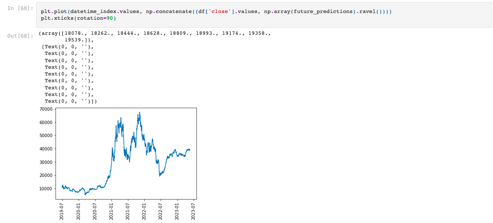

# Bitcoin AI Projection Comparison
A comparison of two neural network models fitted on 3 years of historic daily and weekly bitcoin pricing data used to project one year out into the future.

---

## Technologies

This application is written in Python v. 3.9.7 and makes use of
the following libraries:

[tensorflow](https://www.tensorflow.org/api_docs) was used to build neural network models

[yfinance](https://pypi.org/project/yfinance/) was used to download historic crypto data

[pandas](https://pandas.pydata.org/docs/) was used for data analysis and configuration

[numpy](https://numpy.org/doc/) was used for mathematical operations

[sklearn](https://scikit-learn.org/stable/) was used for scaling data

[matplotlib](https://scikit-learn.org/stable/) was used for graping historic procing data and future projections

---

## Installation Guide

Prior to running this application, perform the following in the command line to install the required libraries:

`pip install tensorflow`

`pip install yfinance`

`pip install pandas`

`pip install numpy`

`pip install sklearn`

`pip install matplotlib`

---

## Usage

In order to launch the application, navigate to the Bitcoin_AI_Projection_Comparison folder, open New_Models.ipynb, and run the cells to see the daily versus weekly comparison of the LSTM models. Next, open Active_Learning.ipynb and run the cells to see the daily versus weekly one year projections of the active learning model. Below is an example of the output of running the cells that shows a graph of the last 3 years of bitcoin data as well as a one year future projection using the active learning model:

---

## Contributors

Robby Odum, Kai Huang, Chance Griffin, Asia Perry, James Milan

Emails: rodum012@gmail.com, kaihuang0721@gmail.com, griffc5@unlv.nevada.edu, Asia.Perry02@gmail.com, cryptoklektik@gmail.com

---

## License

MIT